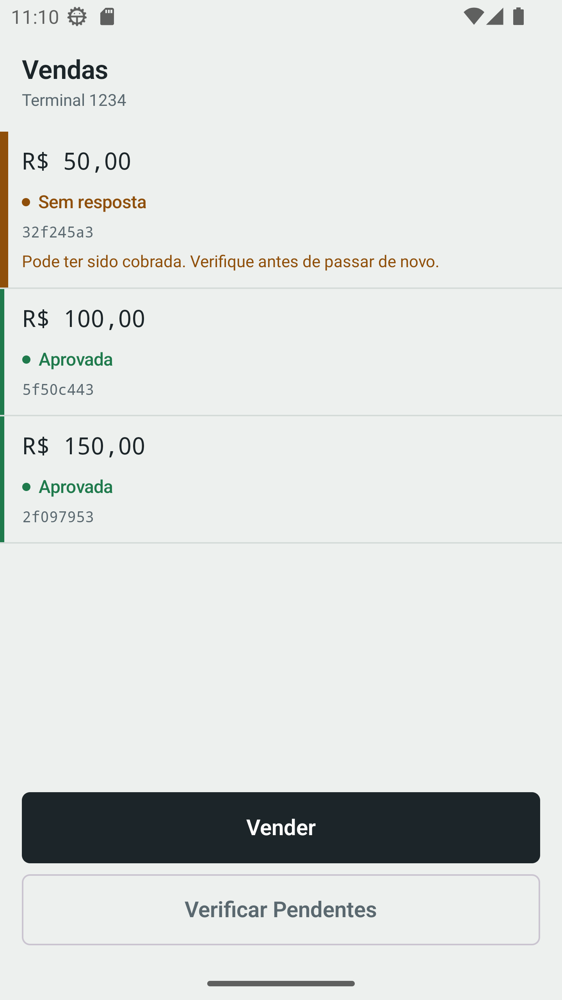
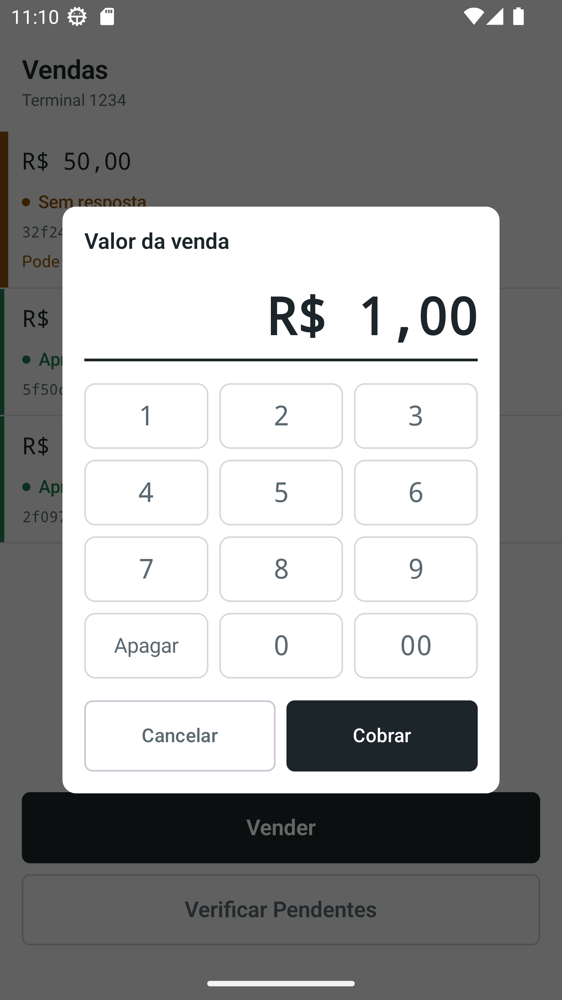
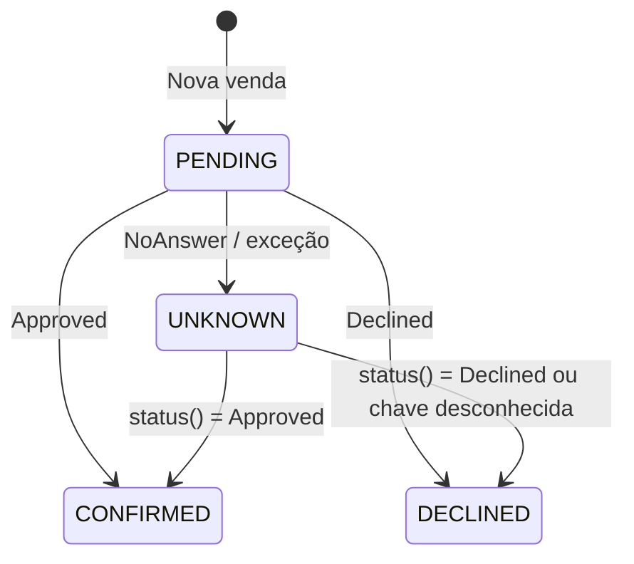
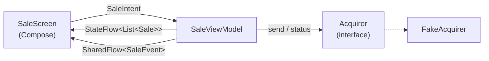

# Payment Demo

App Android que simula um **terminal de vendas (POS)**, feito com Kotlin e Jetpack Compose.
O foco do projeto é um problema real de meios de pagamento: **o que fazer quando uma
cobrança é enviada e a adquirente não responde?**

Nesse cenário a venda pode ter sido aprovada ou não. Se o operador tentar cobrar de novo, o
cliente pode acabar pagando duas vezes. O app trata esse caso com **chaves de idempotência** e um
estado próprio para vendas **sem resposta**, que podem ser verificadas depois.

<p align="center">
  
  &nbsp;&nbsp;
  
  &nbsp;&nbsp;
</p>

---

## Funcionalidades

- **Nova venda:** um teclado numérico próprio monta o valor em centavos, exibido em reais (R$).
  O botão "Cobrar" fica desabilitado enquanto o valor for zero.
- **Lista de vendas:** a venda mais recente aparece primeiro. Cada item mostra o valor, o status
  com cor e os primeiros caracteres da chave de idempotência.
- **Status em tempo real:** cada venda começa como *Enviando* e muda para *Aprovada*, *Recusada*
  ou *Sem resposta* conforme o retorno da adquirente.
- **Vendas sem resposta em destaque:** essas vendas têm uma barra lateral mais grossa e o aviso
  *"Pode ter sido cobrada. Verifique antes de passar de novo."*
- **Verificar pendentes:** consulta na adquirente o status real de cada venda sem resposta,
  usando a mesma chave de idempotência da cobrança original.
- **Feedback com snackbar:** avisos quando uma venda é enviada, quando a verificação começa e
  quantas vendas foram verificadas.

---

## O problema: falhas de rede em pagamentos

Quando a requisição de cobrança dá erro, o app **não sabe** o que aconteceu do outro lado. Por isso
ele não marca a venda como recusada:

| Situação                                      | Estado da venda | Label na UI    |
|-----------------------------------------------|-----------------|----------------|
| Cobrança enviada, aguardando retorno          | `PENDING`       | Enviando       |
| Adquirente aprovou                            | `CONFIRMED`     | Aprovada       |
| Adquirente recusou                            | `DECLINED`      | Recusada       |
| Timeout, erro de rede ou sem retorno          | `UNKNOWN`       | Sem resposta   |

O fluxo funciona assim:

1. Toda venda recebe um `idempotencyKey` (UUID) **antes** de ser enviada e entra na lista como
   `PENDING`.
2. Se o `Acquirer.send(...)` lançar uma exceção, a venda vai para `UNKNOWN`, **não** para
   `DECLINED`. `CancellationException` é relançada para não quebrar o cancelamento estruturado
   das coroutines.
3. Em **Verificar pendentes**, o app chama `Acquirer.status(idempotencyKey)` para cada venda
   `UNKNOWN`:
   - se a adquirente conhece a chave, a venda recebe o status real (aprovada ou recusada);
   - se a adquirente não conhece a chave, a cobrança nunca chegou lá e a venda é marcada como
     recusada. Nesse caso é seguro cobrar de novo.
4. Do lado da adquirente, reenviar a mesma chave devolve o resultado já registrado em vez de
   cobrar outra vez.



---

## Arquitetura

O app segue **MVVM com intents no estilo MVI**. A UI envia *intents* para o ViewModel, observa o
estado por `StateFlow` e recebe eventos únicos (snackbars) por `SharedFlow`.



- **`Acquirer`**: interface que abstrai a adquirente (`send` e `status`). O app usa
  `FakeAcquirer`, que simula latência e guarda os resultados por chave de idempotência. Trocar
  por uma integração real não exige mudanças no ViewModel nem na UI.
- **`SaleViewModel`**: guarda a lista de vendas e trata as intents `NewSale` e `VerifyUnknown`.
  A adquirente é injetada pelo construtor (com `viewModelFactory`), o que facilita os testes.
- **Modelos (`model/`)**: `Sale`, `SaleState` e `PaymentResult`. São Kotlin puro, sem dependência
  do Android.
- **UI (`view/`)**: componentes Compose reutilizáveis (`PrimaryButton`, `SecondaryButton`,
  `Keypad`, `SaleRow`, `StatusDot`...) e um design system próprio com cores, espaçamentos
  (`Space.kt`) e tipografia. O mapeamento de estado para label e cor fica em `SaleStateUi.kt`,
  separado do modelo de domínio.

### Estrutura de pastas

```
app/src/main/java/br/com/thiago/paymentdemo/
├── Acquirers.kt              # Interface Acquirer + FakeAcquirer
├── model/                    # Sale, SaleState, PaymentResult
├── utils/                    # Formatação em BRL, UUID, mapeamentos de estado
├── viewmodel/                # SaleViewModel, SaleIntent, SaleEvent
└── view/
    ├── MainActivity.kt
    └── ui/
        ├── component/        # Componentes Compose reutilizáveis
        ├── model/            # Mapeamento de estado para UI (label/cor)
        ├── screen/           # SaleScreen
        └── theme/            # Design system: Color, Space, Type, Theme

app/src/test/java/br/com/thiago/paymentdemo/
├── fake/                     # ApprovingAcquirer, ThrowingAcquirer
├── rule/                     # MainDispatcherRule
└── viewmodel/                # SaleViewModelTest
```

---

## Testes

Os testes unitários rodam na JVM e cobrem o comportamento do `SaleViewModel` com adquirentes
fake:

- **`ApprovingAcquirer`**: sempre aprova. Verifica que a venda passa por `PENDING` antes de chegar
  a `CONFIRMED`.
- **`ThrowingAcquirer`**: sempre lança `IOException`. Garante que uma falha de rede vira `UNKNOWN`
  e **não** `DECLINED`.

Ferramentas: `kotlinx-coroutines-test` (`runTest`, `advanceUntilIdle`), uma `MainDispatcherRule`
com `StandardTestDispatcher` e **Turbine** para checar a sequência de emissões do `StateFlow`.

```bash
./gradlew test
```

---

## Tecnologias

| Categoria    | Stack                                                        |
|--------------|--------------------------------------------------------------|
| Linguagem    | Kotlin 2.1                                                   |
| UI           | Jetpack Compose, Material 3                                  |
| Arquitetura  | MVVM + intents, `ViewModel`, `StateFlow` / `SharedFlow`      |
| Assincronia  | Kotlin Coroutines                                            |
| Testes       | JUnit 4, kotlinx-coroutines-test, Turbine                    |
| Build        | Gradle (Kotlin DSL), Version Catalog (`libs.versions.toml`)  |
| Android      | `minSdk 24`, `targetSdk 36`                                  |

---

## Como executar

**Pré-requisitos:** Android Studio (versão recente) e JDK 11 ou superior.

```bash
git clone git@github.com:thiago-fullenbach/payment-demo.git
cd payment-demo
```

Abra o projeto no Android Studio e rode em um emulador ou dispositivo. Pela linha de comando:

```bash
./gradlew assembleDebug      # gera o APK de debug
./gradlew installDebug       # instala no dispositivo conectado
./gradlew test               # testes unitários
./gradlew lint               # análise estática
```

> No Windows, use `gradlew.bat` no lugar de `./gradlew`.

---

## Próximos passos

- [ ] Configurar o `FakeAcquirer` para simular recusas e falhas de rede também pela UI
- [ ] Persistir as vendas localmente (Room) para não perder vendas `UNKNOWN` quando o app fecha
- [ ] Ampliar os testes (fluxo de verificação, eventos de snackbar, testes de UI com Compose)
- [ ] Injeção de dependência com Hilt ou Koin

---

## Autor

**Thiago Carvalho Füllenbach**

- GitHub: [@thiago-fullenbach](https://github.com/thiago-fullenbach)
- LinkedIn: [@thiago-fullenbach](https://www.linkedin.com/in/thiago-fullenbach/)
